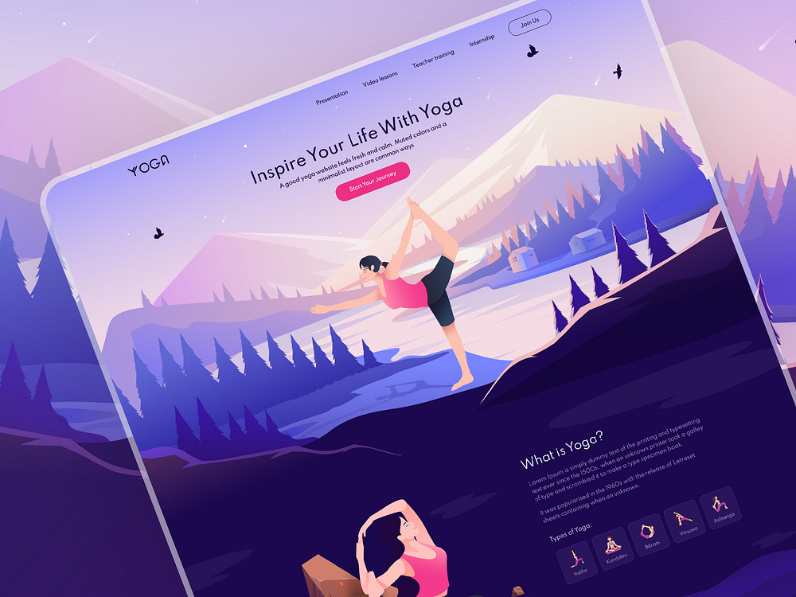
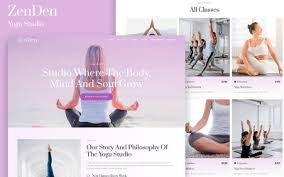
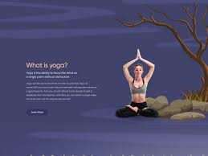

# ZenFlow Yoga App - Marketplace Listing

## App Details
- **Title**: ZenFlow Yoga App  
- **Summary**: Find your inner peace through guided yoga and meditation.  
- **Full Description**:  
  ZenFlow Yoga App is your companion for holistic well-being. Designed for beginners and seasoned practitioners alike, this app offers guided yoga sessions, meditation tracks, and breathing exercises to help you relax, energize, and grow. With features like daily practice reminders, a progress tracker, and personalized session recommendations, ZenFlow supports your journey toward mindfulness and fitness.

## Keywords  
Yoga, Meditation, Wellness, Mindfulness, Fitness, Relaxation, Guided Yoga, Stress Relief  

## Media Assets  
### Screenshots  
1. **Welcome Page**  
   
2. **Yoga Session Selection**  
     
3. **Guided Meditation Interface**  
     

### Promotional Video  
- **Video Title**: Discover ZenFlow  
- **Duration**: 15 seconds  
- **Link**: [Watch on YouTube]([https://youtube.com/example](https://youtu.be/hJbRpHZr_d0?si=qbVIzZSsfNBn1ose))  

